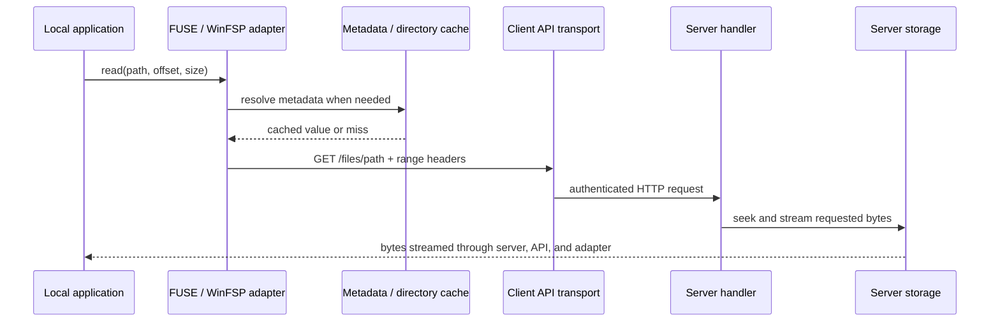
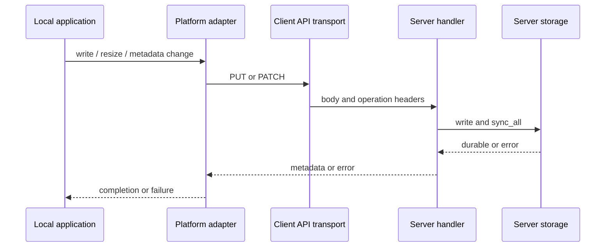
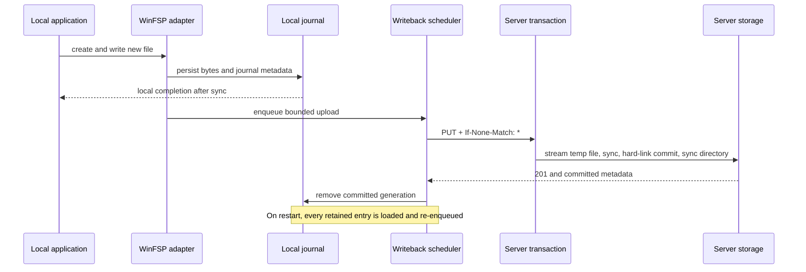

# Architecture

Remote FS is a small workspace with one shared wire-format crate and two
executables. The design keeps filesystem policy on the server, protocol I/O in
one client module, and operating-system behavior at the platform boundary.

```text
protocol/                 Shared v1 headers and JSON types; no I/O or policy
server/
  main.rs                 Process entry point only
  config.rs               Arguments and environment validation
  auth.rs                 Bearer-token middleware
  path_security.rs        Storage-root containment and link rejection
  handlers.rs             HTTP operation orchestration
  metadata.rs             Portable metadata translation
  transaction.rs          Atomic create-only commit
  error.rs                Stable HTTP error mapping
client/
  api.rs                  HTTP transport used by both platform adapters
  ownership.rs            Portable remote-to-local UID/GID fallback
  remote_path.rs          Pure slash-path helpers
  fuse.rs + fuse/ops.rs   FUSE state/cache helpers and kernel callbacks
  windows.rs              WinFSP mount, handles, and operation helpers
  windows/ops.rs          WinFSP kernel callbacks
  windows/cache.rs        Windows metadata/directory cache
  writeback.rs            Upload scheduling, recovery, and conflicts
  writeback/journal.rs    Durable bytes, generations, and journal state
```

The platform adapters are intentionally not forced behind a large common trait.
FUSE and WinFSP have different callback, handle, and durability semantics. Only
the actual common pieces—the HTTP protocol and pure path operations—are shared.

## Data flows

### Read



File data is not cached. Directory and metadata entries are short-lived hints;
mutations update or invalidate the affected entries.

### Synchronous write

FUSE writes and modifications of existing Windows files currently use the
synchronous path:



### Durable Windows new-file commit and recovery



If the destination already exists, the client compares it with the journaled
file. An identical file is treated as a completed retry; different content is a
conflict and the journal is retained.

## Invariants and failure boundaries

- **Storage containment:** API paths contain normal components only. The server
  rejects its internal transaction directory and rejects symbolic-link or
  Windows reparse-point components.
- **Atomic create:** `If-None-Match: *` never exposes a partial destination and
  never replaces an existing destination. The transaction bytes and metadata
  are synced before the destination link is published.
- **Acknowledged Windows new-file data:** WinFSP acknowledges new-file writes
  only after the local journal state is synced. The journal remains until the
  server confirms a durable commit.
- **Crash recovery:** incomplete temporary journal creation is discarded;
  complete journal entries are loaded on the next mount and retried. A
  per-server lock prevents two client processes from replaying one journal.
- **Generation safety:** overwrite and shrink operations create a new durable
  generation before replacing the active one. Sequential growth can update the
  active generation in place.
- **Conflict safety:** retries never silently replace different remote content.
  A conflict or transport failure retains the local copy for inspection/retry.
- **Cache validity:** caches have bounded size and TTL. Mutations update the
  parent listing or invalidate the affected path/tree; file bytes are never
  served from these caches.
- **Error propagation:** filesystem, authentication, malformed-input, and
  conflict errors are returned to the platform adapter. Unexpected server I/O
  details are logged server-side and exposed only as `500 Storage error`.

These guarantees do not replace backups. Simultaneous physical loss of every
journal and server copy cannot be recovered by software.

## Change guidance

- Put new wire fields in `remote-fs-protocol` first and document compatibility
  in [protocol-v1.md](protocol-v1.md).
- Keep path/security decisions on the server and test them without mounting.
- Keep platform callbacks thin; move pure state or conversion logic into a
  focused module only when it has an independently testable contract.
- Add a unit/integration test for the invariant being changed, then run the
  mounted E2E and crash-recovery suites for durability-sensitive changes.
